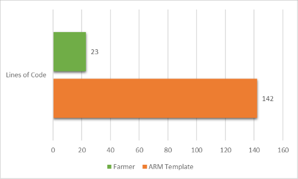



### Making repeatable Azure deployments easy!
Farmer is an easy-to-learn library for rapidly authoring and deploying entire Azure architectures.

* **Infrastructure-as-code, done right**. Simple code snippets allow you to rapidly construct complex topologies.
* **Idempotent deployments**. Safely provision a template repeatedly and know that only changes will be applied.
* **Cross-platform**. Runs on .NET Core on Windows, Mac or Linux.
* **Built on trusted technologies**. Farmer uses Microsoft's Azure Resource Manager (ARM) technology for deployments to Azure.
* **Commercial support available**. [Contact us](https://www.compositional-it.com) for support on how to start creating repeatable deployments.
* **Easy to learn, easy to understand** code through a simple, strongly-typed and pragmatic DSL.

#### Already using ARM templates?
Farmer has you covered.

* **Farmer is completely backwards compatible with ARM templates**. Farmer generates standard ARM templates so you can continue to use existing deployment processes.
* **Safely create dependencies between resources**. Uses static typing to give confidence that your templates will work first time.
* **Easily access common properties of resources**. No more fighting to concatenate cryptic strings!
* **Extensible API**. Add new helpers and members as needed.
* **Open source and free**. Farmer is free to use and modify. We welcome contributions to the project!

#### Why not Azure Resource Manager?
Farmer uses a simple DSL to declare resources and comes with helper functions to perform common tasks. Farmer templates are **around 5-8 times smaller than ARM templates**, meaning they are quicker and easier to author, understand and maintain. **Read more on the [comparison page](arm-vs-farmer/)**.



##### Creating a web application with a configured application insights and a linked storage account

### Farmer Templates

These **23 lines of simple, readable and type-safe code** are translated into **142 lines of JSON ARM template!**

```fsharp
// Create a storage account with a container
let myStorageAccount = storageAccount {
    name "myTestStorage"
    add_public_container "myContainer"
}

// Create a web app with application insights that's connected to the storage account.
let myWebApp = webApp {
    name "myTestWebApp"
    setting "storageKey" myStorageAccount.Key
    always_on
    depends_on myStorageAccount
}

// Create an ARM template
let deployment = arm {
    location Location.NorthEurope
    add_resources [
        myStorageAccount
        myWebApp
    ]
}

// Deploy it to Azure!
deployment
|> Writer.quickDeploy "myResourceGroup" Deploy.NoParameters
```

#### Want to try it out? Follow our [quickstart guide](quickstarts/quickstart-1) now!
